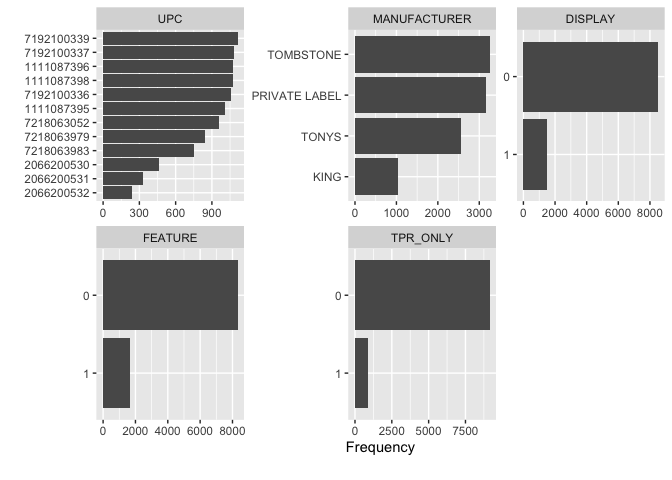
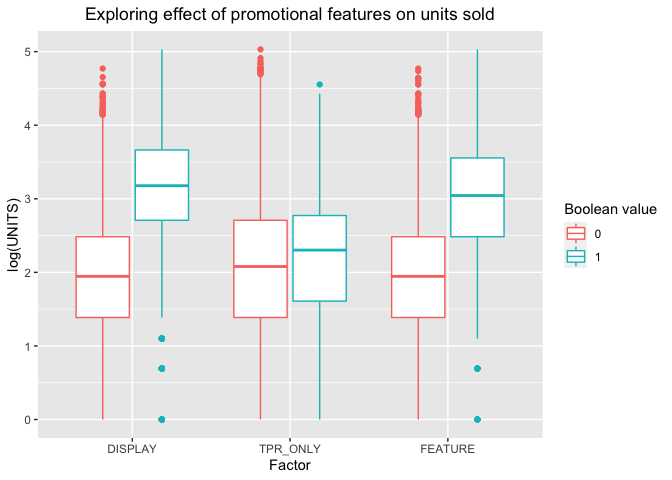
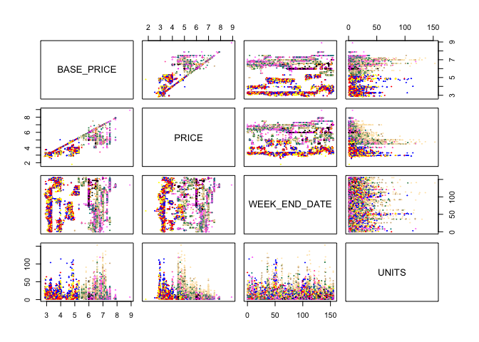
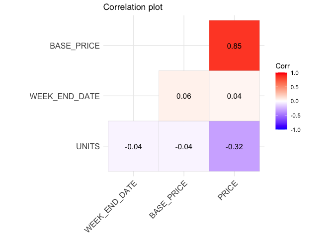
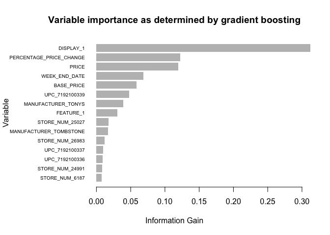

Statistical analysis of grocery store data
================

## Explanatory Analysis

To begin with, an explanatory data analysis was carried out, obtaining
the following plots:

The data set contains 9996 entries for the 12 items in the frozen pizza
category, with no missing data entries. There are 4 manufacturers, with
“Tombstone” and “Private Label” appearing the most in the data set. It’s
also clear that most products do not have an aspect of promotion,
whether being on display, in a leaflet or on a temporary price
reduction. The data set also appears unbalanced, for example data
related to UPC 2066200531 appears 300 times, while UPC’s such as
7192100337 appear roughly 900 times, a three times increase in the
amount of data for the respective products.

The effect of promotion is explored further via boxplots. It shows that
all avenues of promotion increase the amount of log(UNITS) sold, with
DISPLAY and FEATURE seeming to offer the largest increase in sales.

The correlation plot displays the correlation between the factors with
numeric values. The most significant information from this plot, is that
the BASE\_PRICE and PRICE are highly correlated, with a Pearson
correlation coefficient of 0.85. Therefore the regular price of the item
is very similar to the actual amount charged for the product on the
shelf. Also notable is the fact that PRICE and UNITS are negatively
correlated, although to a lesser extent. This makes intuitive sense as
people are generally less likely to buy more expensive products.

The pairwise scatter plot shows the relationship between the
quantitative variables. There is no immediate pattern between
explanatory variables and units when grouped by UPC. There is a clear
association between price and base price, as verified by the correlation
plot.

## Model Selection

A range of models were considered for predicting the units sold. For the
linear model, a general linear model was decided on, as it is most
commonly used to model count data, such as units sold in our case. As
the BASE\_PRICE and PRICE were highly correlated, BASE\_PRICE was
removed and another column titled “PERCENAGE\_PRICE\_CHANGE” was
introduced to help account for the relationship between PRICE and
BASE\_PRICE.

The poisson regression model was chosen as a starting point, as it’s the
most common model used for count data. However there was clear evidence
of overdispersion, as the the residual deviance should be approximately
chi squared distributed with the stated degrees of freedom, which there
was clear evidence against. Therefore the strict requirement that the
variance must equal the mean is violated.

    ## The null deviance: 107403.1 on 9995 degrees of freedom

    ## The residual deviance: 32267.81 on 9902 degrees of freedom

    ## The five-percent critical value for a chi-squared distribution with 9902 degrees of freedom is: 
    ##  10134.61 
    ##  However the deviance of the model is: 32267.81

The quasipossion model was trialed too, for it’s ability to fit an extra
dispersion parameter. This gave the same estimates, but with larger
standard errors. However as this model lacks the use of log-likelihood,
it was not possible to use likelihood based tools such as AIC, BIC, or
deviance residuals. For this reason, a negative binomial model was
decided on instead.

A negative binomial with a log link function was used, with the variable
MANUFACTURER also removed, as UPC perfectly predicts MANUFACTURER, and
the UPC variable contains more refined data compared to MANUFACTURER.
One to three interactions were considered, the first interaction being
PRICE:UPC. This is due to the fact that a particular products will
affect the price, for example premium pizzas generally cost more. The
interactions PERCENTAGE\_PRICE\_CHANGE:FEATURE and
PERCENTAGE\_PRICE\_CHANGE:DISPLAY was also considered, as generally
products displayed or advertised have an association with the price
change, for example premium pizzas are often displayed when on discount
to boost sales. It can be seen that there was not a large difference in
AIC between the model with PRICE:UPC interaction compared to the model
with both the PRICE:UPC and PERCENTAGE\_PRICE\_CHANGE:FEATURE. However
the model with all three interactions had the largest AIC value. The
residual deviance also increased slightly between the model with one and
two interactions, with a larger increase in deviance with the model with
all three interactions. Therefore the final model chosen was the one
with only one interaction - UPC:PRICE.

    ## The null deviance of a model with one interation: 31201.58 on 9995 degrees of freedom

    ## The residual deviance of a model with one interation: 10117.68 on 9891 degrees of freedom

    ## The AIC of a model with one interation: 59650.12

    ## The null deviance of a model with two interations: 31206.11 on 9995 degrees of freedom

    ## The residual deviance of a model with two interations: 10117.53 on 9890 degrees of freedom

    ## The AIC of a model with two interations: 59650.65

    ## The null deviance of a model with three interations: 31244.17 on 9995 degrees of freedom

    ## The residual deviance of a model with three interations: 10129.18 on 9889 degrees of freedom

    ## The AIC of a model with three interations: 59653.16

<!-- -->

Diagnostic plots were also looked at. The residuals appear to be
randomly scattered around zero, indicating that they are independent.
The majority of the points lie on the diagonal of the QQ plot, however
outliers tend to curve upwards, but generally the deviance residuals
behave approximately like standard normals. In the Scale Location plot,
most of the points lie under 2 which is reasonable.

The coefficients significant at the 0.1% level are plotted, and it can
be seen that mostly store numbers are deemed the most significant when
looking at the units sold. This could be as some stores are more
strategically placed, or perhaps have better stock. The most significant
coefficients range in value from around 0.5 to 2.5, implying a change in
one unit of the predictor variable results in a log change of the units
sold. There’s also evidence of some of the interactions between PRICE
and certain products being significant, along with whether or not they
are on display.

For the advanced regression methods, random forests was trialed first,
as decision trees often are inaccurate and perform badly on test data.
random forests allow us to measure accuracy of the model by the
proportion of out of bag samples that are correctly classified by the
random forest, effectively reducing variance. Gradient boosting was also
trialed, for its ability to combine weak learners sequentially and
correct previous errors to reduce bias.

    ## Mean absolute error of the Random Forest model: 4.664401

    ## Mean absolute error for optimised XGB: 4.620682

The random forests model gave a mean absolute error of 4.664401, while
the gradient boosting method gave a mean absolute error of 4.620682, a
slight decrease. For the random forest model, the percentage variance
explained was 68.8%, which is relatively high. This indicates the out of
bag predictions explained the target variance of the training set by
68.8%. However, random forests tend to be biased towards variables with
more levels, such as the STORE\_NUM variable. The random forest model
also contained 500 trees, which could potentially lead to overfitting.
In addition, it can be argued that boosting reduces error on both
fronts, by adding each new tree in sequence it reduces bias by capturing
what was missed in the preceding tree. It also reduces variance by
combining many models, whereas random forests tend to only reduce
variance. For these reasons, the final model chosen was the gradient
boosting method.

The graph shows the most important variables, as deemed by gradient
boosting. It’s clear that DISPLAY is by far the most important in terms
of information gain. This implies that the DISPLAY attribute most useful
for discriminating between the classes to be learned. As information
gain is always maximized, the DISPLAY attribute will be tested/split
first. This suggests that knowing the DISPLAY status reduces the
uncertainty about units sold the most.

## Choosing the single “best” model

Both the negative binomial and the gradient boosted methods have
strengths and weaknesses. In order to fit a negative binomial
successfully, the data must fit the model assumptions. In the QQ plot,
there seems to be a quadratic relationship indicating perhaps a
violation on the assumption of normality. In addition sample sizes are
often far must be large enough to obtain reliable estimates of the
overdispersion parameter. Most significantly, there is no systematic way
to discover all the relevant interactions, there are certainly more than
the three picked out earlier. The gradient boosting method is less
stringent on the assumptions required and is able to model complex
relationships. However to get a good prediction, the parameters must be
tuned carefully.

When carrying out the t test on the 10-fold cross validation with the
alternative hypothesis that that mean of test RMSE of the negative
binomial is greater than the mean of the test RMSE for the gradient
boosted method, a p value less than 0.05 was obtained at the 5%
significance level. This implies that the difference in means is not
equal to zero, and that the mean RMSE of the negative binomial is less
than or equal to the mean RMSE of the gradient boosting method.
Therefore it is concluded that the gradient boosted model performs
better in terms of predictive power.

## Final model

The final model chosen is therefore the gradient boosted model. To
generate prediction on the units sold, DISPLAY,
PERCENTAGE\_PRICE\_CHANGE and PRICE offer the most information gain and
are the most important predictive features. The effect of decreasing
PRICE by 10% on the specified UPC will (surprisingly!) decrease the
units sold by 2, going from 13 to 11, keeping all other covariates
constant.
